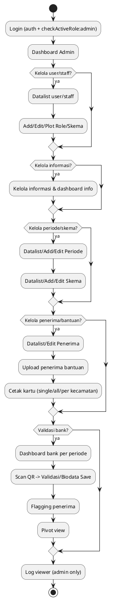
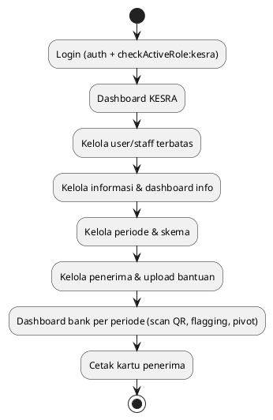
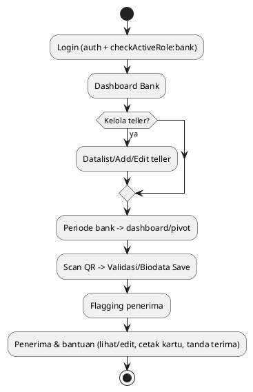
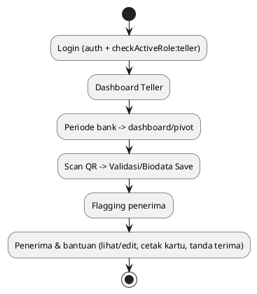
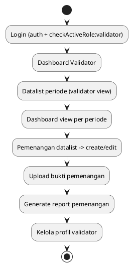
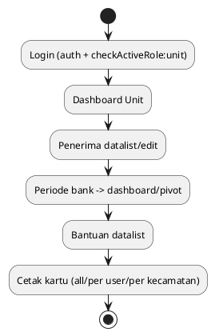
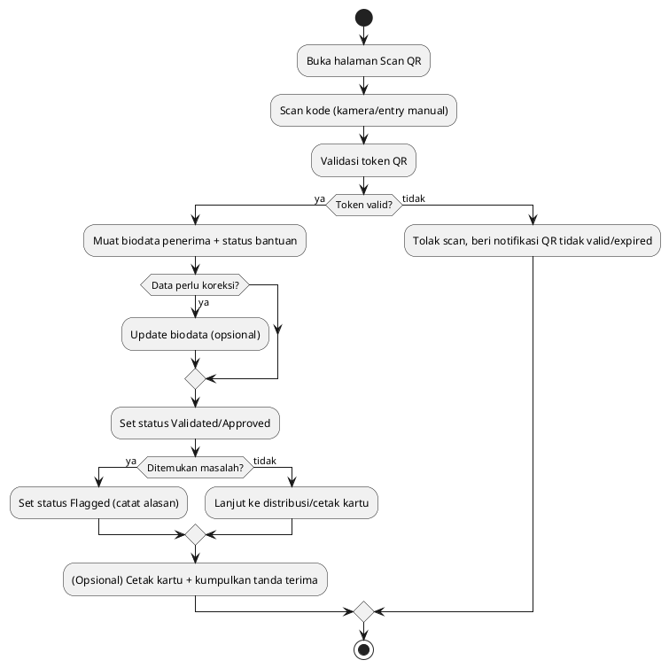
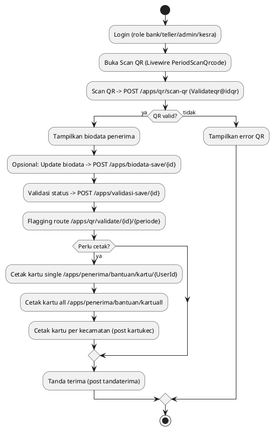
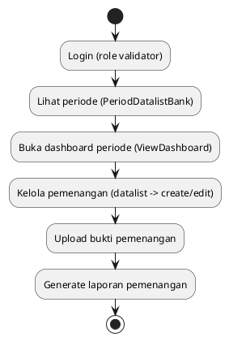
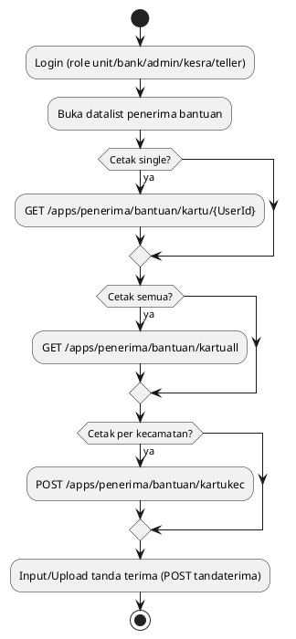

# Flow Sistem SIMKESRA

Dokumentasi alur utama per role berdasarkan definisi route dan fitur di kode saat ini. Flowchart menggunakan PlantUML (dapat ditempel ke https://www.planttext.com/).

## Ringkasan Modul Utama
- Autentikasi: Login, reset password, verifikasi email; middleware `role.redirect`, `auth`, `throttle`.
- Role-based access: Middleware `checkActiveRole:{role}` memisahkan akses per role.
- Dashboard & informasi: Komponen Livewire untuk dashboard, informasi umum, dan log viewer (admin).
- Periode & skema bantuan: CRUD periode, skema, serta dashboard bank per periode.
- Penerima & bantuan: Datalist, edit, upload penerima, cetak kartu, tanda terima.
- Validasi & verifikasi: Scan QR, flagging/validasi, pivot view, laporan pemenangan (validator), bukti unggahan.

## Flow per Role

### Admin
- Akses: Dashboard, log viewer, manajemen user & role, staff teller, informasi, periode, skema, penerima, upload penerima, cetak kartu, dashboard bank (scan QR, flagging, pivot), laporan dashboard informasi.
- Kebutuhan khusus: Hanya admin yang bisa melihat `/logs`.

### KESRA Manager
- Akses: Mirip admin untuk periode/skema/penerima, informasi, dashboard bank (scan QR, flagging, pivot) tetapi tanpa log viewer dan tanpa cetak kartu massal kecamatan.

### Bank Officer
- Akses: Dashboard bank per periode, manage teller (add/edit), scan QR & validasi, flagging, pivot, penerima & kartu, tanda terima. Tidak ada CRUD skema/periode penuh.

### Teller
- Akses: Dashboard, periode bank (dashboard, scan QR, flagging, pivot), penerima & bantuan (lihat/edit, cetak kartu, tanda terima). Tidak kelola teller lain.

### Validator
- Akses: Dashboard validator, datalist periode, dashboard view, pemenangan (datalist/create), upload bukti, laporan pemenangan, kelola profil.

### Unit Head
- Akses: Dashboard, datalist/edit penerima, periode (view dashboard/pivot), bantuan (datalist, cetak kartu, kartu per kecamatan).

## Catatan Teknis
- Middleware per role: `checkActiveRole:{role}` pada setiap grup route.
- Autentikasi & keamanan: throttle login, verifikasi email, CSP diaktifkan (`CSP_ENABLED=true`), reCAPTCHA tersedia di frontend.
- Komponen utama berbasis Livewire; beberapa aksi khusus via controller (`Validateqr` untuk scan/validasi QR, `Kartu/Kartuall` untuk cetak kartu).
- Untuk menggambar flow, salin blok PlantUML di atas ke PlantText.

## Flow Detail Modul

### Modul Autentikasi & Akses
- Login → cek throttle → cek role aktif → redirect ke dashboard sesuai role.
- Lupa password → kirim link reset → verifikasi token → set password baru.
- Verifikasi email → kirim ulang link bila diminta → setelah verifikasi, akses normal.
- Middleware role memastikan tiap grup route hanya bisa diakses oleh role sesuai.

### Modul Manajemen User & Staff
- Admin/KESRA: daftar user/staff → tambah/edit → plot role → (opsional) plot skema.
- Bank: daftar teller → tambah/edit → aktif/nonaktif.
- Hasil akhir: user punya peran jelas untuk akses modul lainnya.

### Modul Informasi & Dashboard Informasi
- Lihat daftar informasi → tambah/edit konten informasi → tampil di dashboard informasi.
- Digunakan lintas role (admin/kesra) untuk menyebar info operasional.

### Modul Periode Bantuan
- Daftar periode → tambah/edit periode (nama, waktu, status) → aktifkan untuk penggunaan.
- Periode aktif jadi konteks untuk penerima, bank dashboard, validator, cetak kartu.

### Modul Skema Bantuan
- Daftar skema → tambah/edit skema (jenis bantuan, kriteria, nominal/benefit).
- Skema dikaitkan ke periode dan penerima bantuan.

### Modul Penerima & Bantuan
- Daftar penerima → edit data penerima.
- Upload penerima bantuan (bulk) → mapping ke periode & skema.
- Lihat daftar penerima bantuan per periode → cetak kartu (single/all/per kecamatan) → unggah tanda terima.

### Modul Validasi QR & Flagging (Bank/Teller/Admin/KESRA)
- Scan QR penerima → validasi token → tampil biodata.
- (Opsional) perbarui biodata → simpan validasi status → flagging hasil.
- Pivot view untuk analisis status penerima per periode.

### Modul Pemenangan (Validator)
- Lihat periode → buka dashboard periode → kelola data pemenangan (buat/edit).
- Unggah bukti pemenangan → hasilkan laporan pemenangan.

### Modul Cetak Kartu & Tanda Terima
- Akses daftar penerima bantuan → pilih mode cetak: single, semua, per kecamatan.
- Cetak kartu → distribusi → unggah/isi tanda terima sebagai bukti penyerahan.

### Modul Dashboard Per Role
- Admin/KESRA: dashboard umum + informasi + bank dashboard + manajemen data.
- Bank/Teller: dashboard bank fokus operasional (scan QR, validasi, pivot).
- Validator: dashboard verifikasi dan pemenangan.
- Unit: dashboard monitoring penerima & cetak kartu.

## Detail Status & Keputusan per Modul

### Status Umum Penerima/Bantuan
- Draft → Pending → Approved/Validated → Distributed → Flagged (gagal/tolak) → Done.
- Flagging dipakai saat validasi gagal, data tidak cocok, atau QR tidak valid.
- Tanda terima dan bukti cetak kartu menjadi penutup alur distribusi.

### Periode Bantuan
- Draft: baru dibuat, belum diaktifkan untuk operasi.
- Aktif: dipakai untuk scan/validasi/penerima bantuan.
- Selesai/Close: hanya untuk laporan, tidak menerima transaksi baru.

### Pemenangan (Validator)
- Kandidat → Diverifikasi → Pemenang/Tolak → Bukti diunggah → Laporan diterbitkan.

### Pivot & Analitik
- Menyajikan jumlah penerima per status (pending/validated/flagged/distributed) dan per lokasi/periode.

## Alur Lengkap (lebih rinci)

### Alur Upload Penerima Bantuan (Admin/KESRA)
1) Siapkan file penerima (format sesuai template).
2) Unggah ke halaman upload penerima bantuan.
3) Sistem memetakan ke periode & skema aktif.
4) Data tampil di datalist penerima bantuan untuk verifikasi manual.
5) Lanjut ke proses cetak kartu / distribusi.

### Alur Scan QR → Validasi → Flagging → Distribusi

### Alur Cetak Kartu & Tanda Terima (Single/All/Per Kecamatan)
1) Pilih penerima atau filter (all/kecamatan).
2) Generate kartu sesuai pilihan.
3) Distribusi fisik kepada penerima.
4) Isi/unggah tanda terima sebagai bukti serah-terima.

### Alur Pemenangan (Validator)
1) Pilih periode yang dievaluasi.
2) Lihat daftar kandidat pemenangan.
3) Verifikasi data & dokumen.
4) Set status pemenang/ditolak.
5) Unggah bukti pendukung.
6) Terbitkan laporan pemenangan.

### Alur Informasi & Dashboard Informasi
1) Buat/ubah konten informasi.
2) Publikasi ke dashboard informasi pengguna.
3) Informasi tampil untuk role terkait sebagai referensi operasional.

### Alur Manajemen User/Staff/Teller
1) Datalist user/staff/teller.
2) Tambah/edit data profil dan penugasan (role, skema, bank/unit).
3) Aktif/nonaktif pengguna.
4) Pengguna baru mengikuti alur autentikasi umum sebelum mengakses modul.

## Edge Case & Validasi Data (ringkasan)
- Scan QR gagal: token tidak dikenal/expired → tampilkan error, tidak ubah status penerima.
- Flagging: digunakan jika data mismatch, dokumen kurang, atau penerima tidak berhak.
- Periode tidak aktif: blok operasi scan/validasi/cetak untuk periode tersebut.
- Duplikasi penerima pada upload: harus ditangani via verifikasi datalist sebelum distribusi.
- Cetak massal: pastikan filter (all/kecamatan) benar untuk mencegah distribusi salah sasaran.

### Proses Bank: Scan QR → Validasi → Flagging → Cetak Kartu

### Proses Pemenangan (Validator)

### Proses Cetak Kartu & Tanda Terima (Unit/Bank/Admin)

## Entitas Kunci & Field Utama (ringkasan)
- **Users**: id, name, email, password, role_id/permissions, is_active, unit/bank references.
- **Roles/Permissions**: role name (admin, kesra, bank, teller, validator, unit) dan mapping permission (Spatie).
- **Periode**: id, nama_periode, tahun, status (aktif/selesai), tanggal mulai/akhir, kuota, skema_id.
- **Skema Bantuan**: id, nama_skema, deskripsi, nominal/benefit, kriteria.
- **Penerima**: id, nama, NIK, alamat, kelurahan/kecamatan, bank_id, status verifikasi, kontak.
- **Penerima Bantuan (relasi periode)**: periode_id, penerima_id, status (pending/approved/distributed/flagged), qr_token, bukti/berkas.
- **Teller/Staff Bank**: user_id, bank_id, status aktif, assignment periode.
- **Pemenangan (Validator)**: periode_id, penerima_id, status menang/ditolak, bukti (path file), catatan, tanggal verifikasi.
- **Tanda Terima / Cetak Kartu**: nomor tanda terima, penerima_id, periode_id, lokasi (kecamatan), timestamp cetak, petugas.

Catatan: Field rinci mengikuti skema database; daftar di atas menyorot kolom kunci yang terlibat pada alur scan, validasi, flagging, dan pencetakan.
